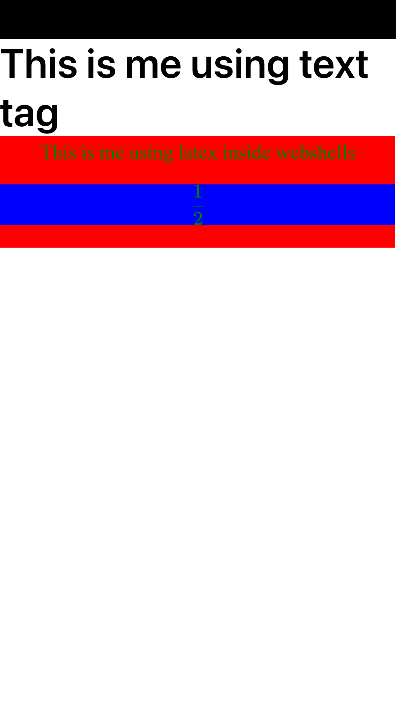

# react-native-latex

Render Math Latex inside react native using katex inside webshell for dynamic height

## Installation

```sh
npm install @ibeginnernoob/react-native-katex
```

## Simple Usage

```js
import MathJax from '@ibeginnernoob/react-native-katex';
import { Text, View } from 'react-native';

export default function HomeScreen() {
  return (
    <View style={{ backgroundColor: 'white', flex: 1, marginTop: 100 }}>
      <Text style={{ fontSize: 40 }}>This is me using text tag</Text>
      <MathJax
        content="This is me using latex inside webshells $$ \frac{1}{2} $$"
        customStyles={{
          fontSize: 50,
          backgroundColor: 'red',
          mathBgColor: 'blue',
          textColor: 'green',
        }}
      />
    </View>
  );
}
```

## The Results looks something like:



## Contributing

- [Development workflow](CONTRIBUTING.md#development-workflow)
- [Sending a pull request](CONTRIBUTING.md#sending-a-pull-request)
- [Code of conduct](CODE_OF_CONDUCT.md)

## License

MIT

---

Made with [create-react-native-library](https://github.com/callstack/react-native-builder-bob)
